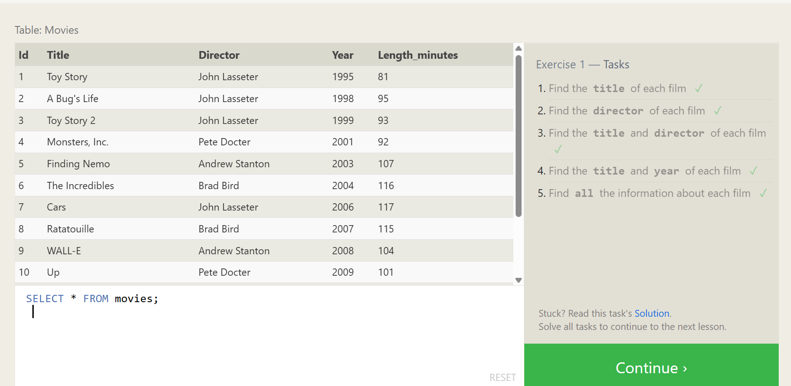
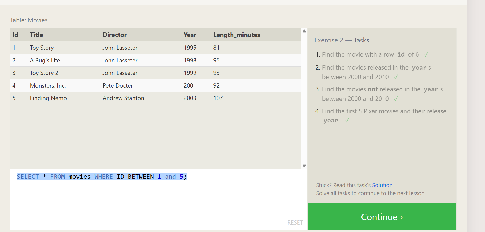
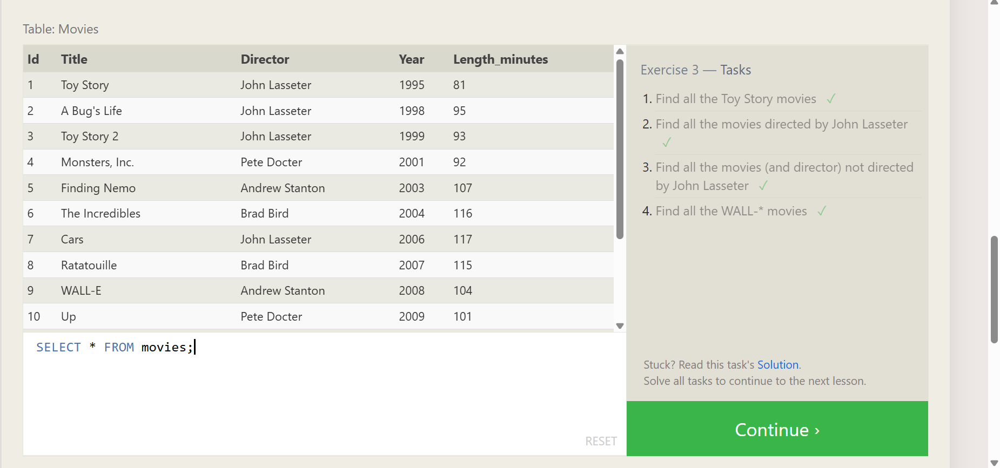
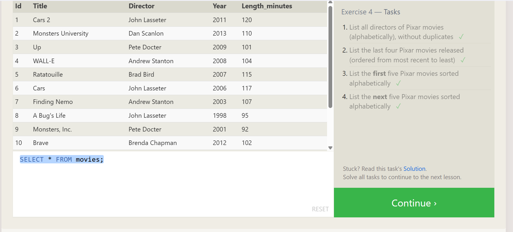

## SQL

# Exercise 1 — Tasks

- Find the title of each film 
  ```sql
  SELECT title FROM movies;
  ```
- Find the director of each film
 ```sql
   SELECT director FROM movies;
 ```
- Find the title and director of each film
 ```sql
SELECT title,director FROM movies;
 ```
- Find the title and year of each film

 ```sql
SELECT title,year FROM movies;
 ```
- Find all the information about each film
 ```sql
SELECT * FROM movies;
 ```




# Exercise 2 — Tasks

- Find the movie with a row id of 6 
```sql
SELECT * FROM movies WHERE id=6;
```
- Find the movies released in the years between 2000 and 2010
```sql
SELECT * FROM movies WHERE year BETWEEN 2000 AND 2010 
```
- Find the movies not released in the years between 2000 and 2010
```sql
SELECT * FROM movies WHERE year NOT BETWEEN 2000 AND 2010 
```
- Find the first 5 Pixar movies and their release year
```sql
SELECT * FROM movies WHERE ID BETWEEN 1 and 5;
```



## Exercise 3 — Tasks

- Find all the Toy Story movies 
```sql
SELECT * FROM movies WHERE title like "toy story%";
```
- Find all the movies directed by John Lasseter
```sql
SELECT * FROM  movies WHERE director like "john lasseter";
```
- Find all the movies (and director) not directed by John Lasseter
```sql
SELECT * FROM  movies WHERE director not like "john lasseter";
```
- Find all the WALL-* movies
```sql
SELECT * FROM  movies WHERE title like "WALL-_"
```




## Exercise 4 — Tasks

- List all directors of Pixar movies (alphabetically), without duplicates
```sql
SELECT Distinct DIRECTOR FROM  movies order by director;
```
- List the last four Pixar movies released (ordered from most recent to least)
```sql
SELECT title,year FROM movies
order by year desc limit 4 
```
- List the first five Pixar movies sorted alphabetically
```sql
SELECT Distinct title FROM  movies order by title asc limit 5
```
- List the next five Pixar movies sorted alphabetically
```sql
SELECT Distinct title FROM  movies order by title asc limit 5 offset 5
```



## Review 5 — Tasks
List all the Canadian cities and their populations 
```sql
SELECT *FROM north_american_cities where country="Canada"
```
Order all the cities in the United States by their latitude from north to south
```sql

```
List all the cities west of Chicago, ordered from west to east
```sql

```
List the two largest cities in Mexico (by population)
```sql

```
List the third and fourth largest cities (by population) in the United States and their population
```sql

```